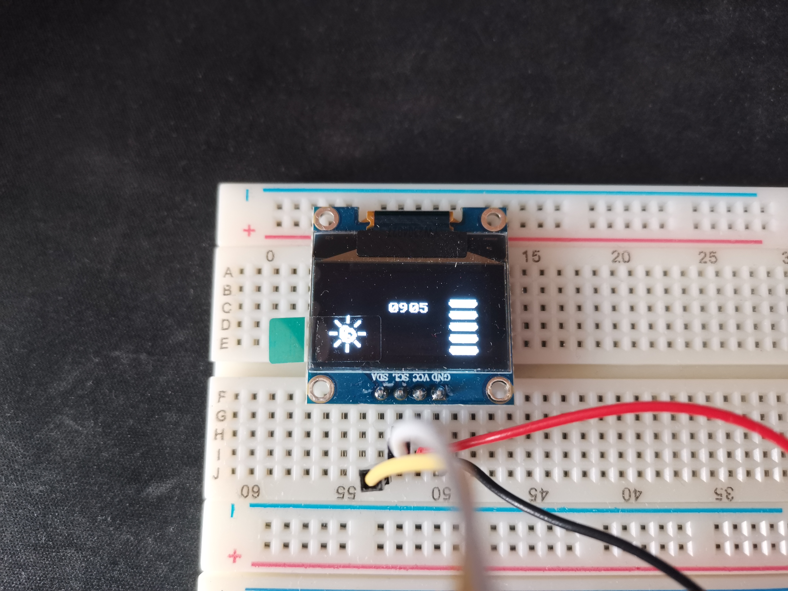

# esp32-lightMeter

This is an example project for interfacing with an SSD1306 OLED display using the ESP-IDF framework. The project reads an analog input value from a photoresistor and displays it on the OLED screen along with a set of LED indicators and a sun icon to represent light levels. The LED indicators represent different light level thresholds.

The project uses ESP-IDF as a development platform. Most of the code if not all of it is written in C.

## Dependencies

This project depends on the [nopnop2002/esp-idf-ssd1306](https://github.com/nopnop2002/esp-idf-ssd1306) library.

## Hardware Setup

Connect your SSD1306 OLED display and LEDs to the GPIO pins as specified in the code. Ensure that the power supply and communication lines are correctly connected.

```
PIN OUTLAY:
---------------------
ESP32     |    OLED
---------------------
GPIO 21 -----> SDA
GPIO 22 -----> SCL
GND     -----> GND
3V3     -----> VCC

---------------------
ESP32     |    LEDS
---------------------
GPIO 25 -----> LED_1
GPIO 26 -----> LED_2
GPIO 27 -----> LED_3
GPIO 14 -----> LED_4
GPIO 12 -----> LED_5

---------------------
ESP32     |    PHOTORESISTOR
---------------------
ADC1_CHANNEL_4 -----> PHOTORESISTOR
```

## Functionality

The code reads an analog input from `ADC_CHANNEL_4` and determines the light level based on thresholds. It then displays the analog value on the OLED screen and controls LEDs according to the light level. Additionally, a sun icon is displayed on the OLED screen when the light level exceeds a certain threshold.

## Customization

You can customize the code to use different GPIO pins for the OLED display, LEDs, and the analog input pin by modifying the corresponding definitions in the code. Additionally, you can adjust the light level thresholds and icon images to suit your application.

Feel free to explore and modify the code as needed for your project.

Enjoy working with your SSD1306 OLED display and ESP32!


